# 配置核查工具操作说明书

面向现场实施与运维人员，说明《配置核查工具包》在 Windows 与麒麟两类被测机上的部署、运行与结果查看方法，以及无法运行自动脚本时使用人工核查台的流程。文中截图均为工具实际运行画面。

工具依据《配置核查作业指导书》v2.2 开展核查，脚本全部使用系统自带解释器（Windows VBScript / 麒麟 Bash），**不依赖 Python 或任何第三方运行库**，拷到被测机即可运行。

## 一、功能与支持范围

工具由 16 个核查脚本与 1 个人工核查台组成，覆盖操作系统、数据库、中间件与网络设备四类对象。

| 序号 | 平台 | 核查对象 | 脚本 | 核查项 | 备注 |
|:--:|---|---|---|---|:--|
| 1 | Windows | 操作系统 | `win\check_xp7.vbs` | 139 | 兼容 XP SP3 / 7 / 10 |
| 2 | Windows | MySQL / MariaDB | `win\check_mysql.vbs` | 19 | 需连接参数 |
| 3 | Windows | Redis | `win\check_redis.vbs` | 16 | 需连接参数 |
| 4 | Windows | 达梦 DM8 | `win\check_dm.vbs` | 19 | 需本机有 disql 客户端 |
| 5 | Windows | SQL Server | `win\check_sqlserver.vbs` | 18 | 需连接参数 |
| 6 | Windows | Nginx | `win\check_nginx.vbs` | 8 | — |
| 7 | Windows | Tomcat | `win\check_tomcat.vbs` | 8 | — |
| 8 | Windows | 网络设备 | `win\check_network.ps1` | 23 | 采集-解析模式，需 Win7+ 与 PowerShell |
| 9 | 麒麟 | 操作系统 | `kylin/check_kylin.sh` | 139 | 需 root / sudo |
| 10 | 麒麟 | MySQL / MariaDB | `kylin/check_mysql.sh` | 19 | 需连接参数 |
| 11 | 麒麟 | Redis | `kylin/check_redis.sh` | 16 | 需连接参数 |
| 12 | 麒麟 | 达梦 DM8 | `kylin/check_dm.sh` | 19 | 需本机有 disql 客户端 |
| 13 | 麒麟 | SQL Server | `kylin/check_sqlserver.sh` | 18 | 需连接参数 |
| 14 | 麒麟 | Nginx | `kylin/check_nginx.sh` | 8 | — |
| 15 | 麒麟 | Tomcat | `kylin/check_tomcat.sh` | 8 | — |
| 16 | 麒麟 | 网络设备 | `kylin/check_network.sh` | 23 | 采集-解析模式，判定逻辑与 Windows 版通用 |
| — | 两平台 | 脚本无法覆盖的机器 | `manual_check.html` | 136 | 浏览器直接打开，人工逐项核对 |

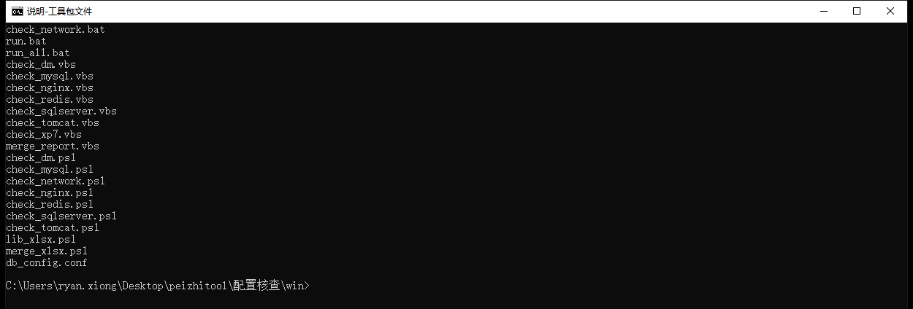

> 在 `win` 目录下执行 `dir /b *.bat *.vbs *.ps1 *.conf` 的实际输出。核查脚本按组件命名，`run_all.bat` 为一键入口，`merge_report.vbs` 负责合并汇总，`db_config.conf` 存放连接参数。

## 二、运行要求

| 平台 | 系统版本 | 权限 | 依赖 | 说明 |
|---|---|---|---|:--|
| Windows | XP SP3 / 7 / 10 | 建议管理员 | 无（系统自带 `cscript`） | 非管理员运行不报错，但部分检查项会因权限不足判为需人工核查 |
| 麒麟 | 银河麒麟 / 中标麒麟 V10 | root 或 sudo | 无（系统自带 bash） | 生成 xlsx 汇总需系统有 `zip` 命令；缺失时自动降级为 xls |
| 人工核查台 | 任意 | — | 现代浏览器 | 单文件、零依赖、可离线使用 |

网络设备核查需要一台能登录设备的 Windows 管理机（PowerShell）或麒麟跳板机。

## 三、工具包结构

```
checklist_tool\
├── win\                      Windows 版（VBScript）
│   ├── check_xp7.vbs         操作系统核查
│   ├── check_*.vbs           数据库/中间件核查
│   ├── check_network.ps1     网络设备核查（需 PowerShell）
│   ├── run_all.bat           一键运行（含汇总）
│   ├── db_config.conf        连接参数配置
│   └── output\               报告输出目录
├── kylin\                    麒麟版（Bash）
│   ├── check_kylin.sh        操作系统核查
│   ├── check_*.sh            数据库/中间件核查
│   ├── check_network.sh      网络设备核查
│   ├── run_all.sh            一键运行（自动探测）
│   ├── db_config.conf        连接参数配置
│   └── output\               报告输出目录
├── 网络设备核查\              网络设备核查独立版
│   ├── run.bat               一键入口
│   └── check_network.ps1/.sh 两平台脚本（同源）
├── manual_check.html         人工核查台（136 项）
├── 配置核查作业指导书_v2.2.docx 核查标准依据
├── 配置核查表_v2.0.0.xlsx      检查项与适用对象矩阵
└── 指导书与核查工具交叉验证报告.docx
```

## 四、Windows 平台操作

### 4.1 部署

将 `win` 目录整体拷贝到被测机任意位置（如 `D:\check`），目录内文件保持原样，无需安装或注册。脚本之间通过相对路径互相调用，**不要把单个脚本单独拷出目录**。若被测机有组策略限制脚本执行，可先将该目录加入白名单，或改用管理员命令行运行。
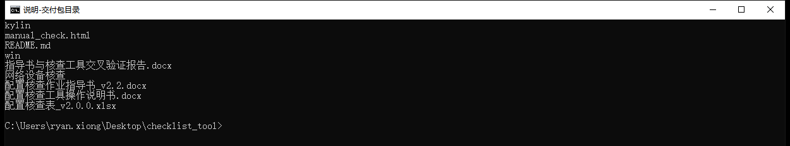

> 在交付包根目录执行 dir /b 的实际输出。拷贝前先核对包内容完整：win 与 kylin 两个脚本目录、网络设备核查独立版、人工核查台 manual_check.html，以及指导书、核查表、操作说明书与交叉验证报告等文档。


```
D:\check> run_all.bat                 :: 一键运行全部（双击亦可）
D:\check> cscript //Nologo check_xp7.vbs        :: 仅核查操作系统
D:\check> cscript //Nologo check_mysql.vbs      :: 仅核查 MySQL
D:\check> cscript //Nologo check_redis.vbs      :: 仅核查 Redis
D:\check> cscript //Nologo check_dm.vbs         :: 仅核查达梦
D:\check> cscript //Nologo check_sqlserver.vbs  :: 仅核查 SQL Server
D:\check> cscript //Nologo check_nginx.vbs      :: 仅核查 Nginx
D:\check> cscript //Nologo check_tomcat.vbs     :: 仅核查 Tomcat
D:\check> cscript //Nologo merge_report.vbs     :: 只合并汇总
```

### 4.2 配置连接参数

只核查操作系统的机器可跳过本步。需要核查数据库或中间件时，编辑 `win\db_config.conf`。

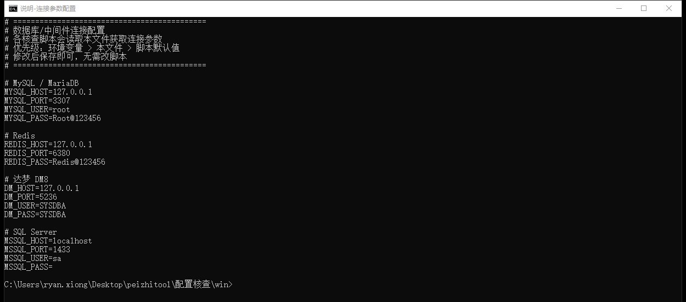

> 执行 `type db_config.conf` 的实际输出。文件按组件分组列出主机、端口、账号与口令；未部署的组件留空即可，脚本会在判定时标记为不适用或转入人工核查。

| 配置项 | 默认值 | 说明 |
|:--|:--|:--|
| `MYSQL_HOST` / `MYSQL_PORT` | `127.0.0.1` / `3307` | MySQL 或 MariaDB 监听地址与端口 |
| `MYSQL_USER` / `MYSQL_PASS` | `root` / `Root@123456` | 建议使用只读核查账号 |
| `REDIS_HOST` / `REDIS_PORT` | `127.0.0.1` / `6380` | Redis 监听地址与端口 |
| `REDIS_PASS` | `Redis@123456` | 未设口令时留空 |
| `DM_HOST` / `DM_PORT` | `127.0.0.1` / `5236` | 达梦 DM8 地址与端口 |
| `DM_USER` / `DM_PASS` | `SYSDBA` / `SYSDBA` | 达梦管理账号 |
| `MSSQL_HOST` / `MSSQL_PORT` | `localhost` / `1433` | SQL Server 地址与端口 |
| `MSSQL_USER` / `MSSQL_PASS` | `sa` / 空 | SQL Server 管理账号 |

取值优先级为 **环境变量 > 本文件 > 脚本默认值**，因此也可以不改文件，直接在命令行用环境变量覆盖：

```
D:\check> set MSSQL_PASS=YourPassword
D:\check> cscript //Nologo check_sqlserver.vbs
```

### 4.3 一键运行全部核查

在 `win` 目录下双击 `run_all.bat`（或右键以管理员身份运行），工具将依次执行操作系统、MySQL、Redis、达梦、SQL Server、Nginx、Tomcat 共 7 项核查，检测到网络设备采集回显时一并解析，最后合并生成汇总报告。

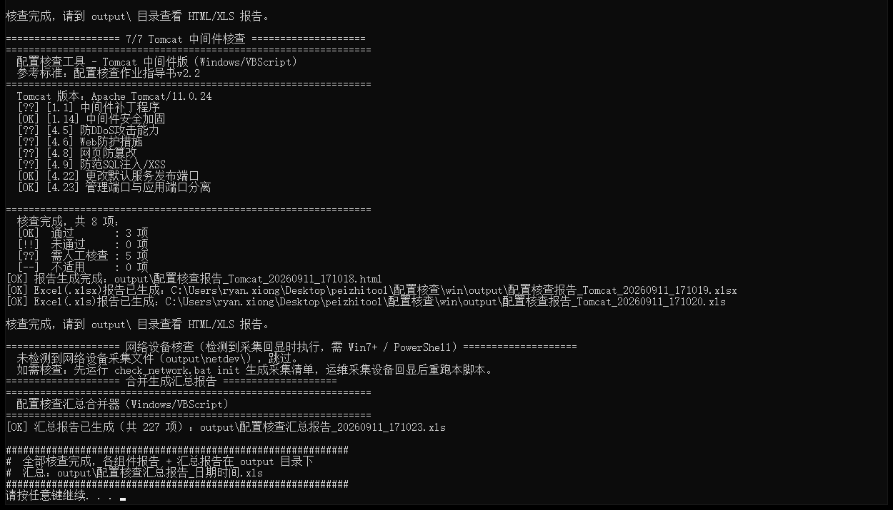

> 执行 `run_all.bat` 的实际画面（图为运行末尾）。每完成一个组件会打印分隔标题与该组件的判定统计；全部完成后合并生成汇总报告并给出总项数，图中汇总为 227 项。整轮耗时取决于机器性能，通常数分钟内完成，过程中不要关闭窗口。

### 4.4 单独运行某个组件

只需核查某一项时，直接运行对应脚本：

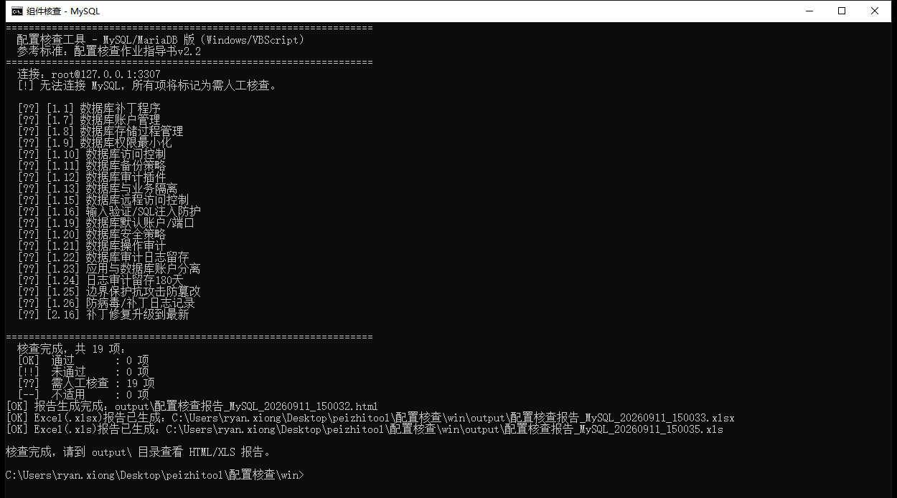

> 执行 `cscript //Nologo check_mysql.vbs` 的实际画面。脚本先连接目标组件，再逐项输出判定并生成报告；目标组件未部署时，该组件全部检查项转入人工核查，仍照常生成报告，不影响其他组件。

### 4.5 网络设备核查

网络设备是独立硬件，无法由被测机直接采集，采用「工具生成命令清单 → 运维登录设备留存回显 → 工具解析回显出报告」的采集-解析方式。在 `网络设备核查` 目录下运行 `run.bat`：首次运行（无回显文件）生成采集清单；把各设备回显按设备名保存为 `output\netdev\<设备名>.txt` 后再运行一次，即解析出第 5 章 23 项判定。

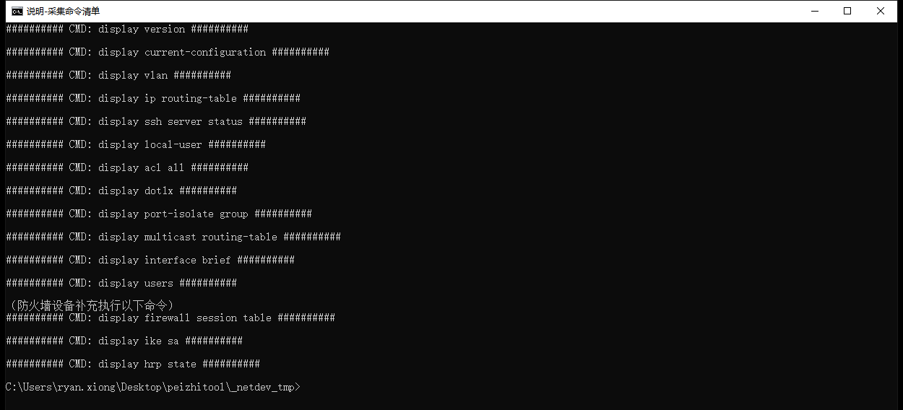

> 执行 init 后 output\netdev 下生成的采集命令清单实际内容，逐行列出需登录设备执行的命令（版本、配置、VLAN、路由、SSH 状态、账户清单、ACL、802.1x、端口隔离、组播表等），防火墙设备另有补充命令。


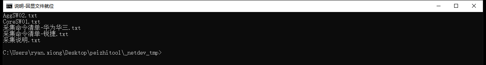

> 运维登录设备执行清单命令后，将回显按设备名保存为 output\netdev\<设备名>.txt（图中 CoreSW01.txt、AggSW02.txt 为两台交换机的回显），即可运行 check 解析出第 5 章 23 项报告。

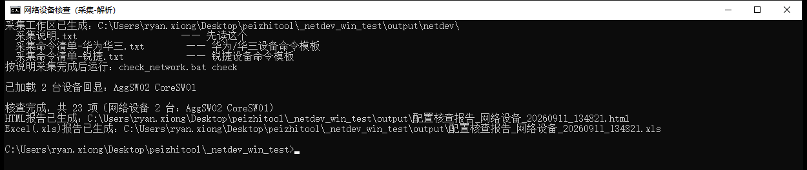

> 先后执行 `check_network.ps1 init` 与 `check_network.ps1 check` 的实际画面。init 生成华为/华三与锐捷两种命令模板；check 读取 `output\netdev` 下的回显文件，逐台解析并生成报告。

## 五、麒麟平台操作

### 5.1 部署与授权

将 `kylin` 目录拷贝到被测机（如 `/opt/check`），赋予执行权限，并确认关键文件齐全：

```
cd /opt/check
chmod +x *.sh
ls -l run_all.sh check_mysql.sh db_config.conf
```

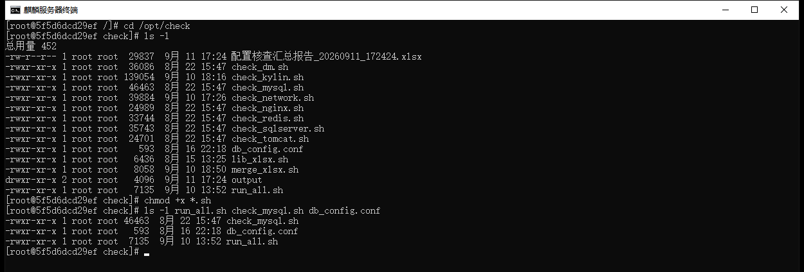

> 实际画面：先 `ls -l` 查看目录内容，再 `chmod +x *.sh` 赋权，最后确认 `run_all.sh`、各组件脚本与 `db_config.conf` 均为可执行且齐全。核查需读取系统配置与日志，建议以 root 或 sudo 运行；非 root 运行不会报错，但部分检查项会判为需人工核查。

### 5.2 一键运行（自动探测）

```
sudo bash run_all.sh
```

工具会先探测本机装了哪些数据库与中间件，只核查探测到的组件，避免在未部署的组件上产生大量「不适用」项。

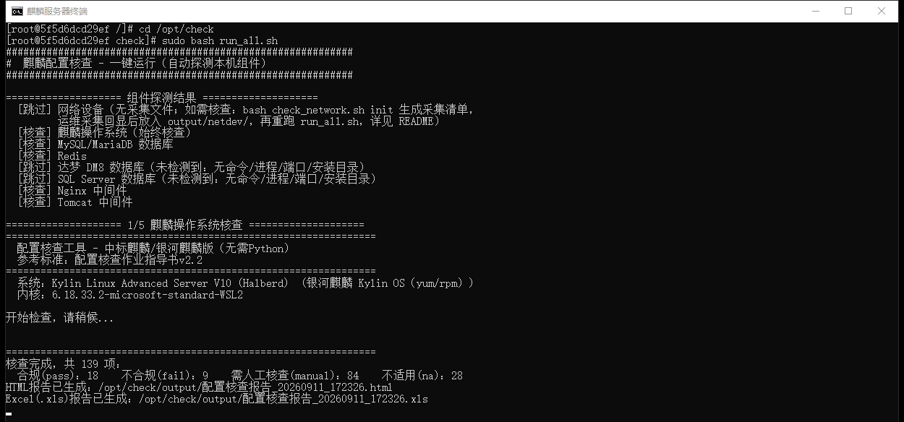

> 执行 `sudo bash run_all.sh` 的实际画面。开头为组件探测结果，逐行标注 `[核查]` 或 `[跳过]` 及原因（图中达梦与 SQL Server 因未检测到而跳过，网络设备因无采集回显而跳过）；随后按步骤执行各组件核查，并打印每项的判定统计。

自动探测可用以下开关调整（写在命令前，用空格分隔）：

```
sudo bash run_all.sh            # 自动探测，只查已装组件
FORCE_ALL=1 sudo bash run_all.sh    # 跳过探测，强制全查
SKIP_MYSQL=1 sudo bash run_all.sh   # 跳过 MySQL
SKIP_DM=1 SKIP_MSSQL=1 sudo bash run_all.sh   # 同时跳过多个
MYSQL_USER=root MYSQL_PASS=xxx sudo bash run_all.sh   # 传连接参数
```

| 开关 | 默认 | 作用 |
|:--|:--|:--|
| `FORCE_ALL` | 不设 | 设为 `1` 时跳过探测，全部组件都核查 |
| `SKIP_MYSQL` `SKIP_REDIS` `SKIP_DM` | 不设 | 设为 `1` 时跳过对应组件 |
| `SKIP_MSSQL` `SKIP_NGINX` `SKIP_TOMCAT` | 不设 | 同上 |
| `MYSQL_*` `REDIS_*` `DM_*` `MSSQL_*` | 空 | 连接参数，优先于 `db_config.conf` |

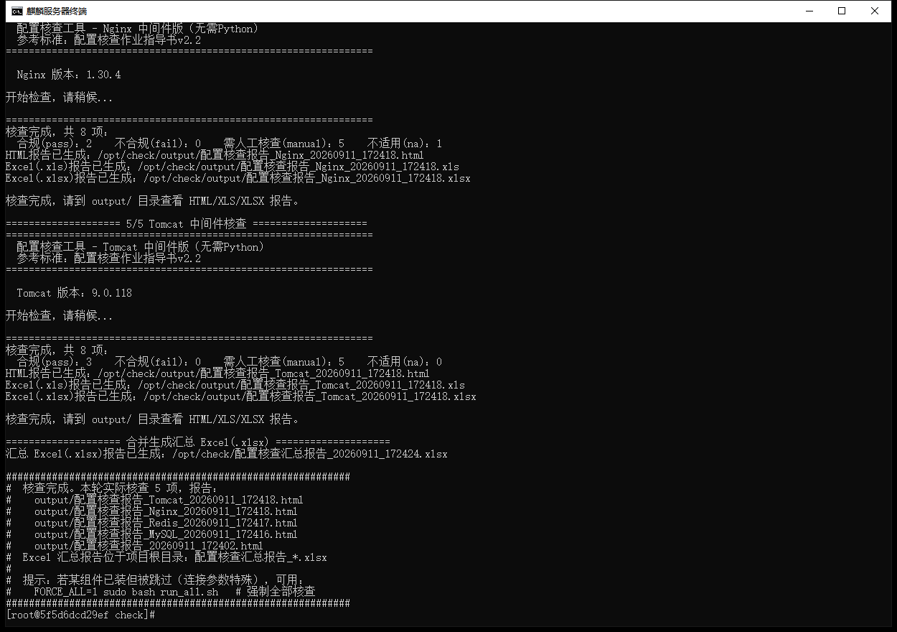

> 同一轮运行末尾的实际画面。各组件核查完成后合并生成汇总 Excel，并列出本轮实际核查项数与全部报告文件路径。

### 5.3 单独运行某个组件

```
cd /opt/check
sudo bash check_mysql.sh
```

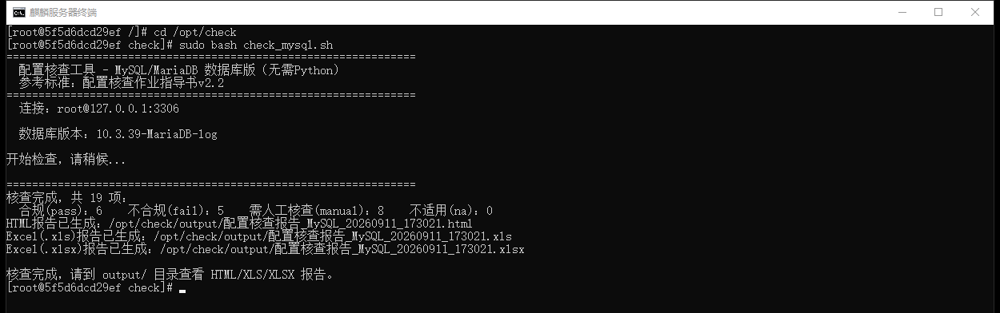

> 执行 `bash check_mysql.sh` 的实际画面。输出判定统计与三种格式报告路径（HTML / XLS / XLSX）。

## 六、输出说明

### 6.1 控制台输出

脚本运行过程中逐项打印判定，四种状态含义如下：

| 标记 | 含义 | 说明 |
|:--:|---|---|
| `[OK]` | 合规 | 检测值与要求一致 |
| `[!!]` | 不合规 | 检测值与要求不符，报告内附整改建议 |
| `[??]` | 需人工核查 | 脚本已完成检测，但结论需结合台账或现场情况确认 |
| `[--]` | 不适用 | 该组件未部署或本机不具备核查条件 |

### 6.2 报告文件

各组件报告与汇总报告均在脚本目录下的 `output` 目录，文件名带时间戳。

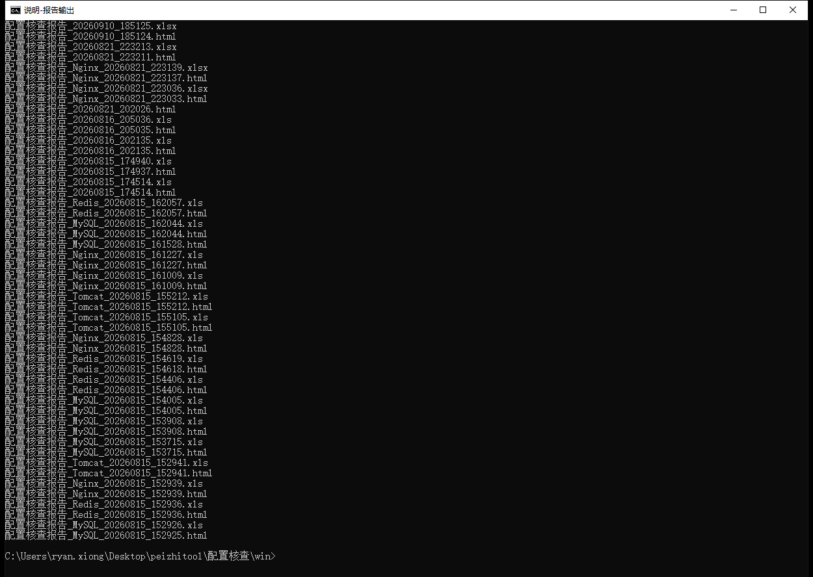

> 执行 `dir /o-d /b output\*.html output\*.xls` 的实际输出。

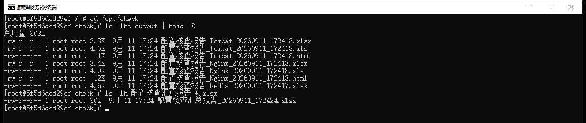


> 麒麟侧生成的 HTML 报告在浏览器中打开的实际效果：页首为系统信息与四态统计卡，下方为逐项明细表，含判定、检测详情、整改建议与对应指导书条款。


> 执行 `ls -lht output | head -8` 与 `ls -lh 配置核查汇总报告_*.xlsx` 的实际输出。

| 文件 | 格式 | 用途 |
|:--|:--|:--|
| `配置核查报告_<组件>_<时间戳>.html` | 网页 | 逐项阅读，支持按状态筛选与关键词搜索 |
| `配置核查报告_<组件>_<时间戳>.xls` | Excel | 单组件结果留存 |
| `配置核查报告_<组件>_<时间戳>.xlsx` | Excel | 麒麟侧生成，供汇总合并 |
| `配置核查汇总报告_<时间戳>.xls/.xlsx` | Excel | **上报用**，含全部组件的逐项判定 |

报告样式如下，逐项列出判定结果、检测详情与对应指导书条款：

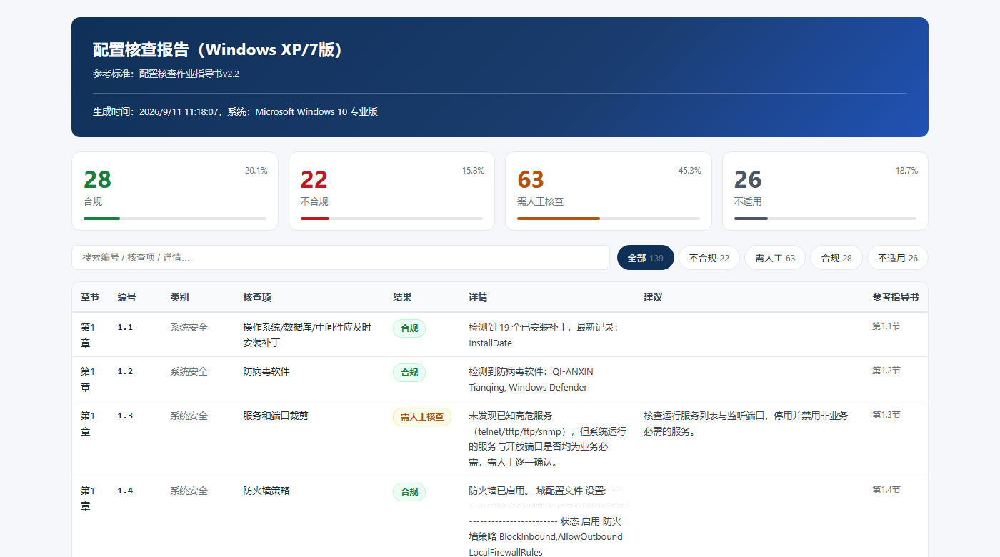

> 操作系统核查报告的实际输出。页首为四态统计卡，下方为逐项明细表，可按状态筛选与关键词搜索。

## 七、人工核查台

对无法运行脚本的机器（只读系统、组策略拦截、非标准平台等），使用 `manual_check.html` 逐项人工核查。该文件为单文件网页，双击即可用浏览器打开，无需网络。

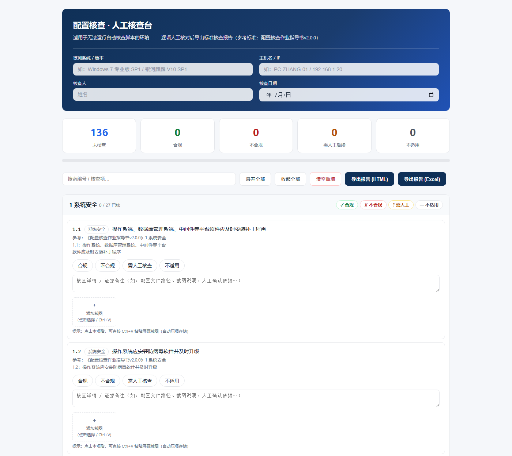

> 打开 `manual_check.html` 的初始状态。顶部填写被测系统、主机名、核查人、核查日期；下方 136 项检查项按章分组，每项提供合规/不合规/需人工核查/不适用四个选项与详情输入框；填写内容自动保存在本机浏览器，关闭页面不丢失。

逐项点选结论、填写核查详情，必要时在卡片下方粘贴证据截图；整章无异议时可用章级批量按钮一键设定，已核查项不受影响。


> 136 项全部填写完成后的实际画面。顶部统计显示未核查 0 项，各章标题右侧显示该章已核进度。图中为演示用示例数据。

填写完成后点击右上角「导出报告 (Excel)」（或「导出报告 (HTML)」），浏览器即下载一份带时间戳的报告文件。

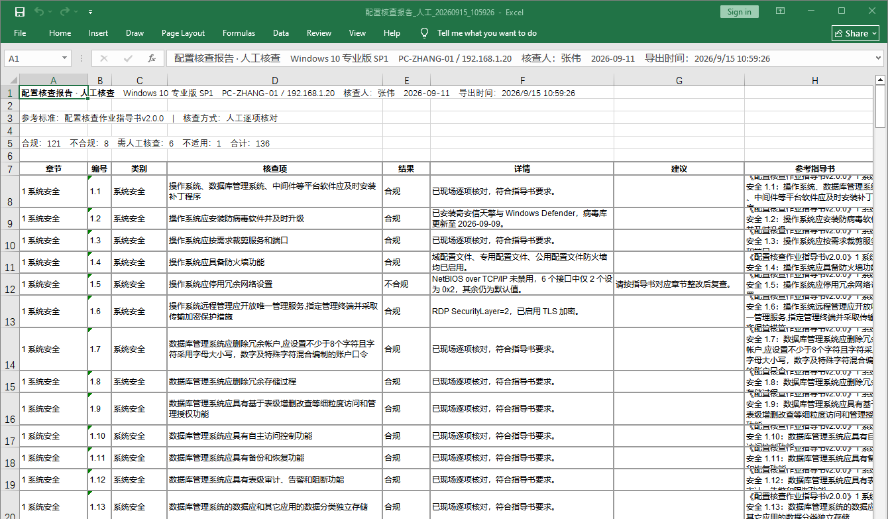

> 点击「导出报告 (Excel)」后由核查台生成、并在 Excel 中打开的实际报告。表头为现场信息与四态统计，表体为 136 行 × 8 列（章节、编号、类别、核查项、结果、详情、建议、参考指导书），与自动脚本出具的报告格式一致。

## 八、结果汇总与上报

人工核查台与自动脚本采用同一套检查项编号与四态判定规则，两部分结果可直接合并：自动脚本的报告在 `output` 目录，人工核查台的导出文件由浏览器下载，按编号对应即可汇总为一份完整报告。汇总口径与《指导书与核查工具交叉验证报告》一致——工具核查结果与人工核查结果同表呈现，逐项可追溯。

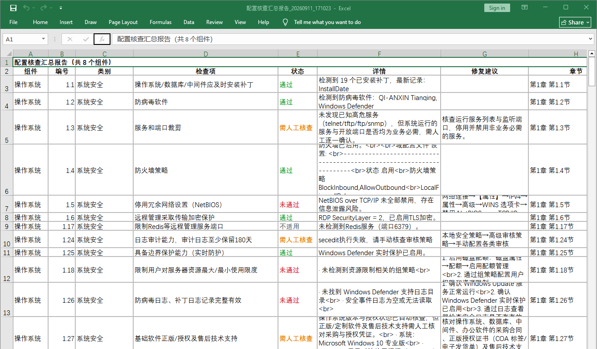

> Windows 版一键运行合并生成的汇总报告在 Excel 中打开的实际效果：表头标注组件数，表体按组件列出全部检查项的判定、详情、修复建议与对应指导书章节，日常上报以此文件为准。


## 九、已知限制

1. **未部署的组件**：脚本会将该组件全部检查项判为「需人工核查」或「不适用」，这是如实反映，不是漏检。要得到该组件的结论，需先安装对应客户端（如达梦 `disql`）或补全连接参数。
2. **权限不足会改变结论**：以非管理员 / 非 root 运行时，读取注册表、事件日志、系统配置的操作可能失败，相应检查项会转为「需人工核查」。
3. **网络设备依赖人工采集**：设备回显须由运维人员登录设备执行命令并留存，工具只负责生成清单与解析回显；未提供回显时该 23 项不会产生结论。
4. **判定依据以脚本源码为准**：报告的检测详情与建议由脚本内的判定分支产生，若被测机环境特殊（如国产化替代路径、非标准部署），建议结合人工核查台复核。
5. **不做整改**：工具只核查不修改配置，报告中给出的是整改建议，改动需由运维按要求执行。

## 十、常见问题

**Q：运行后大量检查项显示「需人工核查」怎么办？**　通常是在非管理员 / 非 root 权限下运行，或目标组件未部署、连接参数未填。以管理员或 sudo 重跑，并在 `db_config.conf` 中补全连接参数。

**Q：某组件全部显示「不适用」是故障吗？**　不是。该组件未安装（如无 `disql` 客户端的达梦、无实例的 SQL Server），属正常判定，无需处理。

**Q：麒麟侧没有生成 xlsx 汇总？**　系统缺少 `zip` 命令，安装后再运行 `merge_xlsx.sh` 即可；HTML 与 XLS 报告不受影响。

**Q：Windows 提示「不是内部或外部命令」？**　需在脚本所在目录运行，或用完整路径调用 `cscript`；不要把脚本单独拷出目录，脚本与 `db_config.conf`、`lib_*` 需在同一目录。

**Q：命令行中文显示乱码？**　先执行 `chcp 65001`（麒麟侧脚本），或使用 `cscript` 而非 `wscript` 运行 VBS 脚本。

**Q：日常上报要打开哪个文件？**　用汇总报告即可，它已含全部组件的逐项判定；需要逐项依据时再打开各组件 HTML 报告。

## 附：使用声明

本工具用于经授权的信息系统安全配置核查，请在被授权范围内使用，核查结果与设备回显等过程材料按被测单位的保密要求留存与流转。
